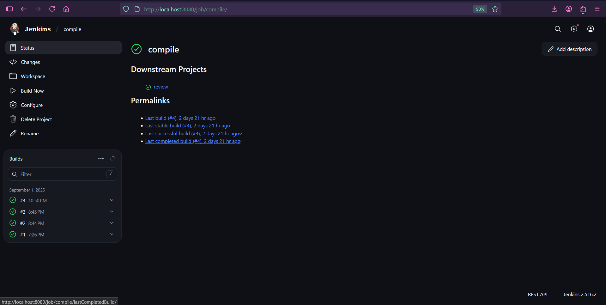
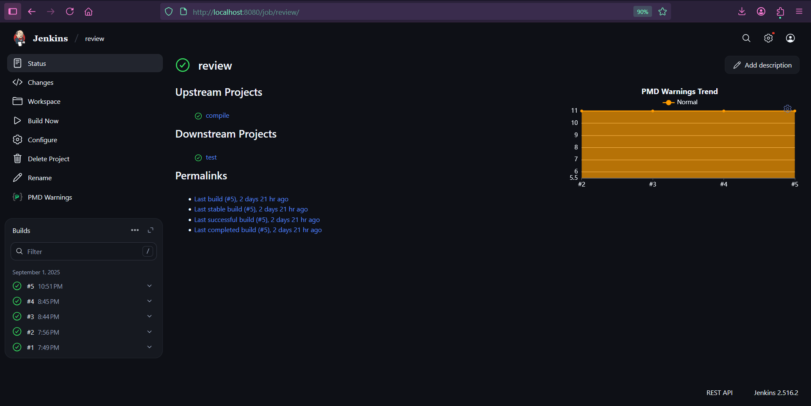
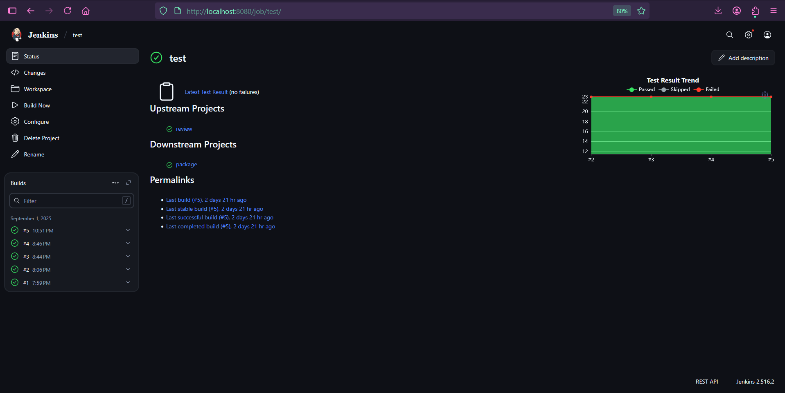
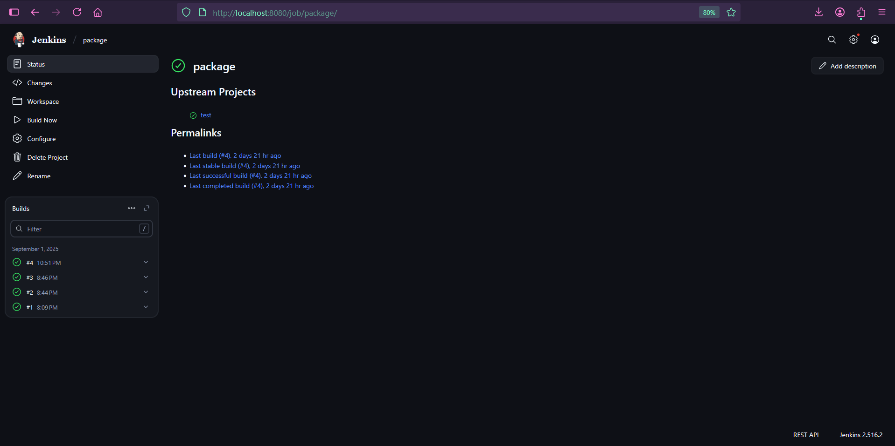

# Jenkins Freestyle Delivery Pipeline

This project demonstrates how to build a delivery pipeline using **Jenkins Freestyle Jobs** with upstream and downstream triggers.  

---

## 🚀 Pipeline Overview
The pipeline consists of 4 stages, implemented as separate Freestyle jobs:

1. **Compile** – Compiles the source code.  
2. **Code Review** – Runs static analysis or linting checks using **PDM Warning**.  
3. **Test** – Executes unit/integration tests using **JUnit Test Result Report**.  
4. **Package** – Packages the build artifacts.  

Jobs are connected using **upstream and downstream triggers**, so the pipeline executes in sequence.

---

## 🔧 Tools & Technologies
- **Jenkins Freestyle Jobs**
- Upstream/Downstream Triggers
- GitHub Integration
- Maven (for build)

---

## 📸 Screenshots

## Code Complie
- 
-------------------------------------
## Code Review
**Code Review is done using PDM Warning Trend Plugin to make sure code dont have any issues.**
-  
-------------------------------------
## Code Test
**Code Test Report is made using JUnit test result report Plugin to check the how many and different test it passed or failed.**
-  
-------------------------------------
## Code Package
- 
-------------------------------------
## Pipeline View
**Pipelin View :-**
**Green Box :- Its means the process is done.**
**Yellow Box :- It means the current process is going onn.**
**Blue Box :- It means the process is yet to start or its**
**Red Box :- It means the process is failed or got an error while running.**
-  
-------------------------------------